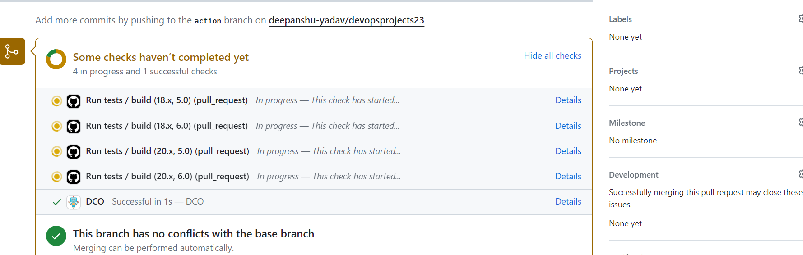

# Introduction

# Local Setup

Follow the following steps if you want to run this app on your local machine.
## Install Node and NPM

Install npm from [here](https://radixweb.com/blog/installing-npm-and-nodejs-on-windows-and-mac)  and node  [here](https://nodejs.org/en/download/package-manager).

## Install mongodb 

Install mongo db from [here](https://www.mongodb.com/docs/manual/installation/).

## Build the application 

Build the application using `npm install`.

## Run the application 

Ensure mongodb is running. You can test using mongo db compass. This is the connection string 
`mongodb://localhost:27017/`. 

After that run `node server.js`

Now go to browser and type `localhost:3000` or `localhost:3000/blog`
 
# Running the tests

Use `npm test` to run the test.


# CI with GitHub Actions

Push something in some branch raise a pull request in the repository. You will see the tests being executed in the actions section.

Like this



# Docker 

Install docker using  `./install_docker_minikube.sh`
Go to the docker directory `cd docker`. 

Run the command `docker-compose build` and then `docker-compose up` . Exit by `docker-compose down` .

To test this now run 

```
azureuser@deepanshudevops:~/exp/data$ curl -sX GET http://localhost:3000
Hello NODE 
```

To send a POST request run this
```
 curl --header "Content-Type: application/json"   --request POST   --data '{"name":"xyz","quantity":"1", "price": "20"}'   http://localhost:3000/products
```

# Kubernetes 

Before using kubernetes we need to push these conatiners to DockerHub. Follow these steps in the next section to 
publish your images to DockerHub. Can skip as it has already been done. 

## Push To DockerHub
We need to publish our containers to DockerHub. 

For that follow the following steps 

Build the mongo db conatiner. 
```
   cd mongo/
   docker build --file Dockerfile . -t mongo:latest
```

```
     cd nodejs/
     docker build --file Dockerfile . --build-arg STATE=DEVELOPMENT -t nodejsapp:development-latest

     docker build --file Dockerfile . --build-arg STATE=PRODUCTION -t nodejsapp:prod-latest
```

Now login into your DockerHub account
   using `docker login`

Now tag these images to your id. Replace pronoob007 with whatever is your id. 
```
    docker tag nodejsapp:development-latest  pronoob007/nodejsapp:development-latest
    docker tag nodejsapp:prod-latest  pronoob007/nodejsapp:prod-latest
    docker tag mongo:latest  pronoob007/mongo:latest
```

Now we can push these images to DockerHub.
```
   docker push pronoob007/nodejsapp:prod-latest
   docker push pronoob007/nodejsapp:development-latest
   docker push pronoob007/mongo:latest
```

## Use Kubernetes 

Install minikube using  `./install_docker_minikube.sh`

We have deployed the kubernetes application in two ways. 

1. Simple Kubenetes  
2. Persistent Volume and Persistent Volume Claim.

### Simple deployment 

Make sure you have run the  minikube cluster 

```
 minikube start  --memory 12000  --cpus 2
```

Use  `cd  kubernetes/simple`

Then apply the following commands. 
```
    kubectl apply -f mongo-deployment.yaml
    kubectl apply -f mongo-service.yaml
    kubectl apply -f node-deploy.yaml
    kubectl apply -f node-service.yaml
```

Now you can get the address for curl request using 

 `minikube service nodejs-service --url `

 For example I got `http://192.168.49.2:30707`

 ```
  curl http://192.168.49.2:30707
 ```

Add some data 

```
 curl --header "Content-Type: application/json"   --request POST   --data '{"name":"xyz","quantity":"1", "price": "20"}'   <address_you_get_above>/products
```

This shows out app is working as before. 

```
$ curl http://192.168.49.2:30707/products
[{"_id":"655a6f85de87398cc510d2e0","name":"xyz","quantity":1,"price":20,"createdAt":"2023-11-19T20:26:45.763Z","updatedAt":"2023-11-19T20:26:45.763Z","__v":0}]
```

### Persistent Volume and Persistent Volume Claim

`cd kubernetes/pv_pvc` and runt he following to apply PVC and PVC claims. 

```
kubectl apply -f mongodb-pv.yaml
kubectl apply -f mongo-db-pvc.yaml
kubectl apply -f mongo-pv-deploy.yaml
```


Now got to the earlier kubernetes directory `cd kubernetes/simple` assuming you are back in root directory of project.  

Now run the following 
```
kubectl apply -f mongo-service.yaml
kubectl apply -f node-deploy.yaml
kubectl apply -f node-service.yaml
```

Repeat the same procedure you did with kubernetes to verify the app is running. 

# Vagrant and Ansible 
