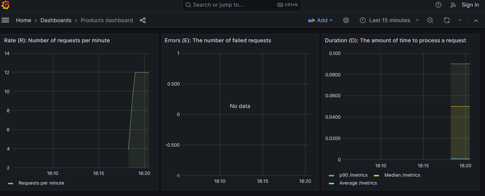
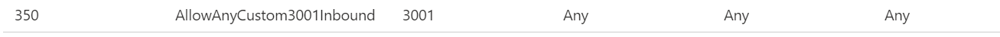
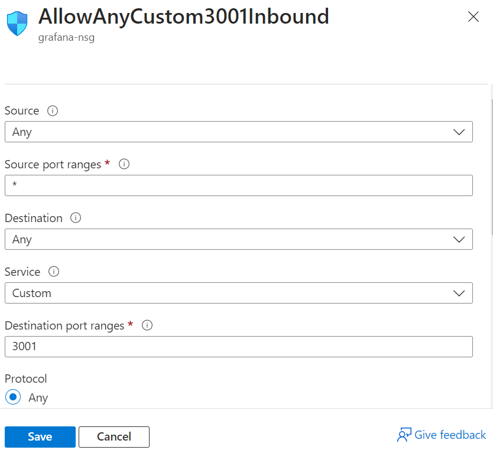

# Monitoring using prometheus and grafana

Make sure you have installed docker and docker compose follow the docker [README.md](../docker/README.md)

Now do 
`docker-compose up` 

You can stats using
`curl -sX GET http://localhost:3001` 

or better open in browser like this. 

Use `http://localhost:3001`.

Note if you are doing this in azure apply the following inbound rule like this. 

Use the following config.

